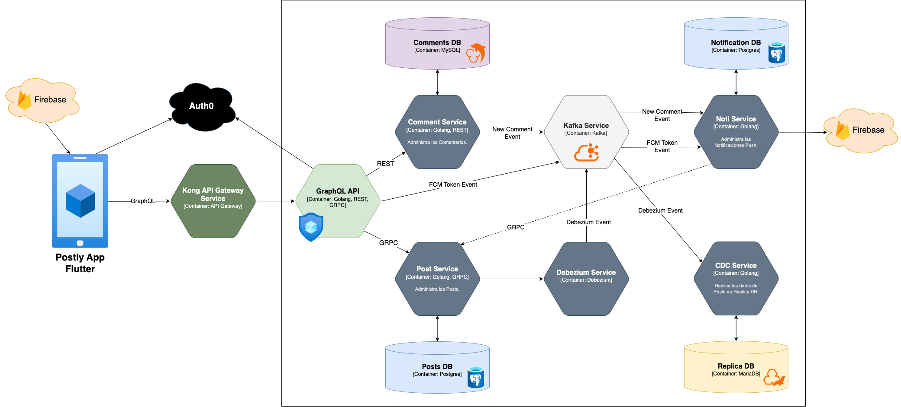

# Proyecto Final Grupo 1

## Integrantes
- Fuentes Espinoza Pablo Gustavo
- Rengel Rivera Mateo Santiago
- Guerra Campuzano César Hugo
- Guamán Guamán Saúl Germán
- Cabascango García Amanda Elizabeth
- Calo Catota Carlos Edison
- Vela Moya Christian Eduardo

## Descripción del proyecto

El sistema presentado en este proyecto trata de emular un Blog, en donde diferentes personas pueden autenticarse en una aplicación móvil, realizar publicaciones y comentarlas. Cuando una publicación recibe un comentario, una notificación push es inmediatamente enviada al autor de la publicación.

## Arquitectura del proyecto

<div style="width: 100%; display: flex; justify-content: center; align-items: center">

</div>

## Estructura del Proyecto

El proyecto está dividido en varios servicios y componentes, como se describe a continuación:

- **commentservice**: Servicio para gestionar comentarios.
- **postpb**: Definición servicio GRPC postservice en protocol buffers.
- **postservice**: Servicio para manejar publicaciones.
- **notiservice**: Servicio encargado de enviar notificaciones push a la app usando Firebase Cloud Messaging.
- **debezium**: Servicio que ejecuta Debezium, el cual escucha los cambios de "postdb".
- **cdcservice**: Servicio encargado de replicar los cambios notificados por Debezium a través de Kafka a una base de datos MariaDB (replicadb).
- **kafka**: Levanta una instancia de Apache Kafka para la comunicación entre microservicios.
- **gqlapi**: API Principal del sistema en GraphQL, internamente se conecta con los servicios postservice y commentservice. Está protegida usando Auth0.
- **kongapigw**: API Gateway que redirecciona los requests al API GraphQL interno.
- **postly_app**: App móvil hecha en Flutter que se comunica con el sistema a través de Kong API Gateway.
- **Makefile**: Archivo con comandos útiles para la generación de archivos de protocol buffers y GraphQL.
- **docker-compose.yml**: Configuración para levantar todo el sistema.

## Levantamiento del proyecto

Antes de levantar el proyecto usando Docker, se debe ajustar las variables de entorno. Para ello, agregar un archivo `.env` al mismo nivel del archivo `docker-compose.yml` y establecer las siguientes variables:
```sh
AUTH0_DOMAIN=<your-auth0-domain>
AUTH0_AUDIENCE=<your-auth0-api-identifier>
AUTH0_CLIENT_ID=<your-auth0-client-id>
AUHT0_CLIENT_SECRET=<your-auth0-client-secret>
```

El servicio `notiservice` por otro lado necesita que se coloque en su carpeta el archivo `serviceAccountKey.json` que se puede descargar de la consola de Firebase y así permitir la conexión con el SDK de Firebase Cloud Messaging de lado del servidor.

La aplicación móvil Postly también necesita ser configurada para su con Firebase Cloud Messaging, para lo cual se debe ejecutar:
```bash
flutterfire configure
```

Una vez listas estas configuraciones podemos levantar todo el backend usando:
```bash
docker compose up -d
```

Luego, para la ejecución de la app podemos ir a la carpeta ./postly_app y ejecutar:
```bash
flutter build apk
flutter install -d <device-id>
```

## Endpoints

El servicio `commentservice` proporciona una API REST con los siguientes endpoints:

### 1. `POST /`
Crea un nuevo comentario.

**Request Body:**
```json
{
  "content": "string",
  "postID": "int",
  "authorID": "int"
}
```
**Response:**
```json
{
  "id": "int",
  "content": "string",
  "postID": "int",
  "authorID": "int"
}
```
### 2. `GET /`
Obtiene todos los comentarios.

**Response:**
```json
[
  {
    "id": "int",
    "content": "string",
    "postID": "int",
    "authorID": "int"
  }
]
```
### 3. `GET /:id`
Obtiene un comentario específico por ID.

**Response:**
```json
{
  "id": "int",
  "content": "string",
  "postID": "int",
  "authorID": "int"
}
```
### 4. `PATCH /:id`
Crea un nuevo comentario.

**Request Body:**
```json
{
  "content": "string"
}
```
**Response:**
```json
{
  "id": "int",
  "content": "string",
  "postID": "int",
  "authorID": "int"
}
```
### 5. `DELETE /:id`
Elimina un comentario por ID.

**Response:**
- `200 OK` si se elimina correctamente.
- `404 Not Found` si no se encuentra el comentario.

